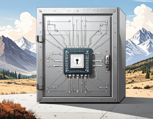
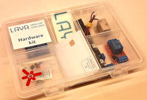

# 

  # 
Mit der [__LAYR Open Chip Challenge__](https://github.com/OCDCpro/LAYR/tree/main) schaffen wir eine Plattform, auf der Studierende selbst zum Innovationstreiber werden: Gesucht sind kreative Open-Source-Chipdesigns, die in mehreren Wettbewerbsetappen technisch wachsen, echte Sicherheitsaspekte adressieren und bis hin zum physischen Tape-out begleitet werden. Im Fokus steht nicht nur technisches Können, sondern die aktive Mitgestaltung an digitalen Wertschöpfungsketten und Souveränität – von der Idee bis zur funktionsfähigen Siliziumlösung.

## The challenge

__Link to__ [LAYR 25/26: The Challenge](https://github.com/OCDCpro/LAYR/tree/main/challenge)

The LAYR challenge contains the tasks and informations to enter LAYR. Please start with reading the challenge.

## The hardware kit

__Link to__ [LAYR 25/26: The hardware kit](https://github.com/OCDCpro/LAYR/tree/main/hardware_kit)

Every team will get a LAYR 25/26 hardware kit. The kits will be distributed by the teams supervisors. The link takes you to the description of the hardware kit and some additional informations about the content and the components.

__IMPORTANT:__ The IDs and KEYS on the Javacards (NFC-cards) are pre-programmed by the LAYR team. A list of the cards, IDs and keys is provided with the descriptions.

#### License

Shield: [![CC BY 4.0][cc-by-shield]][cc-by]

This work is licensed under a
[Creative Commons Attribution 4.0 International License][cc-by].

[![CC BY 4.0][cc-by-image]][cc-by]

[cc-by]: http://creativecommons.org/licenses/by/4.0/
[cc-by-image]: https://i.creativecommons.org/l/by/4.0/88x31.png
[cc-by-shield]: https://img.shields.io/badge/License-CC%20BY%204.0-lightgrey.svg
