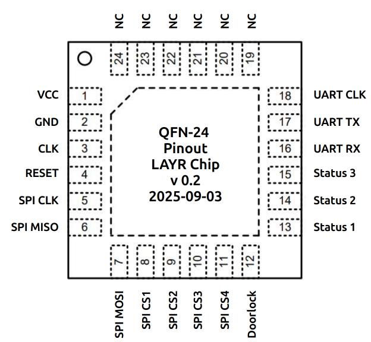
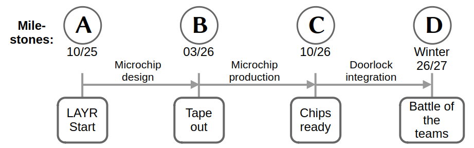

# LAYR 25/26: The Challenge

#### Content:
1. Storyline: The "Guardian" Assignment
2. Tasks  
    2.1. Design a microchip  
    2.2. Security by design  
    2.3. Verification  
    2.4. Tapeout  
    2.5. Battle of the teams  
3. Timeline and Milestones
4. Deliverables
5. Judging criteria

## 1. Storyline: The "Guardian" Assignment

You and your entire team were recently hired to design the core of a next-generation security system guarding a classified research vault. The vault has a physical door lock that is supposed to be opened by traditional keycards. Your task is to design this digital system. Because you have leftover budget for manufacturing your custom chip, you start “Project Guardian”, which is a great opportunity to deploy a custom chip.

This “Guardian” chip must be able to securely perform some form of authentication protocol (more details later) with the keycard and, if the card succeeds and returns an authorized ID, activate the door's locking mechanism. Your chip will interface with the outside world through two critical communication channels:

* **Keycard reader:** This is your primary input. The chip will need to communicate with a provided contactless ISO/IEC 14443-A card reader via a Serial Peripheral Interface (SPI). Depending on the chosen Security-by-Design (more details later), different protocol messages need to be exchanged with the smart card.
* **Switch interface:** This is your primary output. Once the chip has verified the access privileges of the card holder, it must set the corresponding output pin to a high logic level. This signal will be the electronic "key" that unlocks the door.

Additionally, there is an **SPI-EEPROM** located on the development board, which will be used as non-volatile storage to hold a shared key between the lock and the keycard for authentication purposes (only applicable on higher security levels) and the list of allowed card IDs that should have access to the given door.

Your design should consist of a digital logic circuit described in a Hardware Description Language (HDL). The ultimate goal is to create a small, fast, and secure chip.

**Competition!** Today you found out that not only your team will work for this chip, but that many more teams across your entire enterprise were tasked to complete this crucial project. You are all competing in a challenge!

All teams share the same design environment, templates and test benches to start your work on. As the security level is not fixed yet, your team can freely choose from four different security levels to target.

## 2. Tasks

### 2.1. Design a microchip

#### Description

Microchip for the doorlock. 

#### Functionality

* Doorlock
* Security by design
* Verification 

#### Packaging

**Package name**
  * **QFN-24**  

**Pinout:**

**Padframe:**
To be defined. Repo available?

#### Pins
| Name  | Function | IO | Description |
|:----  | :----     | :----  | :----  |
| Pin1  | VCC       | Input  |   |   
| Pin2  | GND       | Input  |   |
| Pin3  | CLK       | Input  |   |
| Pin4  | Reset     | Input  |   |
| Pin5  | SPI SCLK  | Output |   |
| Pin6  | SPI MISO  | Input  |   |
| Pin7  | SPI MOSI  | Output |   |
| Pin8  | SPI CS1   | Output |   |
| Pin9  | SPI CS2   | Output |   |
| Pin10 | SPI CS3   | Output |   |
| Pin11 | SPI CS4   | Output |   |
| Pin12 | Doorlock  | Output |   |
| Pin13 | Status 1  | Output |   |
| Pin14 | Status 2  | Output |   |
| Pin15 | Status 3  | Output |   |
| Pin16 | UART RX   | Input  |   |
| Pin17 | UART TX   | Output |   |
| Pin18 | UART CLK  | Input  |   |

#### Clock / Reset

* Clockspeed: XXX MHz. 
* Reset is not inverted.

#### External components

* Memory Chip for Key Storage:
  * SPI Memory 
* NFC Reader:
  * RC522
* Doorlock (electronic-mechanical, one output pin)
* Status Indicators (3 x LEDs on output pins)

#### Communication Interfaces

* SPI:
  * NFC Reader RC522
  * Memory Chip for Key Storage   
* Doorlock:
  * Pin high opens the door
* Status Indicators (LEDs):
  * Pin high lights the LED
 
### 2.2. Security-by-Design Levels

In a scenario like this there are many possible attack vectors (e.g., side-channel analysis or fault injection attacks) to consider and a large number of possible countermeasures to increase the security of a given design. To guide your efforts in this area, we propose four different security levels that each include different common aspects of secure hardware design. You can choose any security level or, alternatively, start at some level and work your way up during the competition. There is no need to choose a fixed level at the start of the competition and you have full flexibility right until the end.

**Note:** It might make sense to already think ahead before you start implementing a lower security level since you otherwise might need to adjust a larger amount of your code.

**Security Levels:**

* **Level 0:** Your chip includes no additional countermeasures, but you must ensure functional correctness of the simple OCDC Identification Protocol (see protocol specification below). Additionally, you should perform and document a basic form of threat modeling.
* **Level 1:** Implementation of improved OCDC Authenticated Identification Protocol (see protocol specification below) instead of just reading out a static ID. You once again need to ensure functional correctness.
* **Level 2** (intermediate): Protection against passive (power) side-channel attacks. You can freely chose what kinds of countermeasures (masking, hiding, ...) you want to implement to which degree. Please note that you should document your thoughts and argue why you chose which countermeasures and what the intended effect is.
* **Level 3 (advanced):** Protection against active fault-injection attacks. Once again, you can freely choose which countermeasures (redundancy in time, redundancy in area, redundancy in information, ...) to implement, but you should document your choices.

**Note for Level 1-3:** Due to high complexity of relevant countermeasures, secure key storage for the long-term shared AES key between the smart card and the terminal is not part of the competition and you can simply store the key in the external SPI-EEPROM. You don't have to include aspects of key storage and related insecurities in your threat modelling.

#### Protocol Specification

In this section, we provide a short overview of the two protocol variants and the relevant smart card applet command codes. For more information on the concrete implementation, we refer to the README of the GitHub repository containing the JavaCard applet source code (see https://github.com/OCDCpro/javacard-applet/tree/master).

#### OCDC Identification Protocol:

Simply return the card identifier upon receiving a corresponding request without any authentication or encryption.

Command Summary:

| Command     | CLA  | INS  | Description                              |
|-------------|------|------|------------------------------------------|
| `GET_ID`    | 0x80 | 0x12 | Returns the unencrypted 16-byte card ID. |    

#### OCDC Authenticated Identification Protocol:

Both parties have knowledge over a long-term shared AES-128 key.
This key is used to perform mutual authentication and key agreement via a
challenge-response protocol to derive an ephemeral AES-128 session key which
is then used to encrypt the exchanged data, which mainly correspond to the
ID of the card.

- AES Mode: AES-128 ECB, no padding

Command Summary:

| Command     | CLA  | INS  | Description |
|-------------|------|------|-------------|
| `AUTH_INIT` | 0x80 | 0x10 | Card  generates random 8-byte challenge `rc`, computes `AES_psk(rc \|\| 00..00)` using the pre-shared key and returns the ciphertext.                                                               |
| `AUTH`      | 0x80 | 0x11 | Terminal decrypts the ciphertext to recover `rc`, generates its own 8-byte challenge `rt`, and proves possesion of the key to the card by returning `AES_psk(rt \|\| rc)` using the pre-shared key. |
| `GET_ID`    | 0x80 | 0x12 | Derive an ephemeral AES session key as `k_eph = AES_psk(rc \|\| rt)` and returns the 16-byte card ID encrypted using that key if authentication was successful. |

### 2.3. Functional Verification

As part of the competition, each team must verify the functional correctness of their "Guardian" chip implementation. To support this, we provide a simple HDL-based testbench that sets up the basic environment and enables SPI communication between the keycard and your hardware design.

You are required to extend and enhance the provided testbench by implementing your own set of custom functional test cases. These tests should thoroughly verify the correctness of your hardware design and demonstrate that it behaves as expected under various operating conditions. Your custom test cases should focus on:

* Correct handling of OCDC Identification and/or Authenticated Identification Protocol commands (e.g., GET_ID, AUTH);
* SPI communication with the keycard and external EEPROM;
* Validation of both successful and failed authentication attempts;
* Triggering the unlock signal only after proper authorization;
* Handling of edge cases and unexpected inputs (e.g., corrupted messages, timing issues).

Aim to design test cases that cover both realistic scenarios and edge conditions to thoroughly verify your implementation and enhance its robustness and reliability. You are encouraged to think creatively about what to test and how. Your test suite should also reflect the specific design choices you made, particularly regarding your selected security level(s).

To complete the functional verification task, each team must submit a comprehensive verification package demonstrating how the correctness of their "Guardian" chip was tested and validated. Your submission should include:

* A complete **HDL testbench** extended with your own meaningful and well-structured test cases;
* A concise **verification plan or documentation** describing the tested functionality, the rationale behind your test cases, and how your testbench ensures the functional correctness of your design – including both expected behavior and edge-case handling.

This deliverable will help assess your ability to verify complex digital systems in a structured and thorough manner, going beyond basic functionality checks.

### 2.4. Tapeout

To be written (by IHP?)
* GDS submission 
* DRC clean 
* Padframe
* Deadlines
* ....

### 2.5. Battle of the teams

* All teams come together and battle each other. 
* The built microchips will be integrated into the doorlock hardware kit.
* The judges will determine the winning team(s).

## 3. Timeline and Milestones

## 4. Deliverables

The following deliverables have to be submitted at the given Milestones (see table and timeline). 

| Deliverable | Description | Milestone | Date | How to submit? |
|-------------|-------------|-----------|------|----------------|
| **TEAMLIST** | A list of the team members, the supervisor, and the institution.   * Names, Emails, Github handles | A | 10/25 | Email to LAYR team   (flexible but before 02/26) |
| **GDS** | A tapeout-ready GDS of the microchip design:   * Published with an Open-Source License in a Git repository   * Including all sources to rebuild from scratch   * Submitted to IHP for production | B | 03/26 | * Git repo   * IHP Tapeout |
| **DOCS** | Everything written   * Read the judging criteria list thoroughly to ensure you receive the maximum points.| B | 03/26 | Email to LAYR team |
| **BATTLE** | The teams take their door locks to the battle event.   * Presentation   * Demonstration | D | Winter 26/27   Exact date t.b.a. | * Email to LAYR team   * Team's appearance at the event |

## 5. Judging criteria

There will be a total of 100 points distributed according to the percentual weight of the criteria.

#### 5.1. Technical quality (35 %)

How well is the design technically implemented?

* **Functionality:** Does the chip reliably fulfill the functions and tasks?  
* **Verification:** Has the design been tested and are the evidence understandable?
* **Efficiency:** How well does the design do with regard to power, performance and area (ppa)?
* **Robustness:** Is the design stable and expandable beyond the specific challenge?

#### 5.2. LAYR Challenge: Security by Design (25 %)

For **all** security levels:
  - Quality and coverage of the threat modeling
  - Quality of the security-related documentation and justification of design choices

For specific security levels:
  - **Level 2 and up:** Practical side-channel analysis resistance of your implemented design, which is verified through practical measurements. We mainly use the number of required power traces until the correct long-term AES key can reliably be recovered as the target metric.
  - **Level 3:** Quality of the implemented fault-injection countermeasures. Due to time constraints, we will not practically evaluate all submitted designs and instead evaluate the theoretical soundness of implemented countermeasures. Excellent designs might be evaluated separately in a lab setting to analyse actual effectiveness of the chosen protections.

#### 5.3. Creativity (15 %) 

Thinking out of the box?

* Originality, innovation
* Creative usage of resources
* Open source: Discover, use, change, improve, discuss and publish. 
  For example: 
  * 3D, visualizations, renderings, 
  * Git pull request and issues, 
  * New tools, 
  * other OS chips, resources, IPS

#### 5.4. Documentation, practical relevance and evaluation (10%)

* **Technical documentation:** Quality and understandability

How realistic and practical is the development, the solution and the chip?

* Evaluation of the created chip design:  
  * Practical suitability of the built door lock 
  * possible (future) improvements 
  * sustainability

* Development process:  
  * Find and name vulnerabilities

#### 5.5. Presentation and demonstration (15 %)

How is the design conveyed and presented?

* **Presentation:** Understandability and clarity
* **Demonstration:** Persuasiveness (simulation, live demonstration and presentation)

#### 5.6. Bonus

There can be bonuspoints given for special tasks beside the LAYR challenge. Topics could be:

  * Evaluation and ideas for improvement of LAYR
  * Challenges proposals for future LAYR