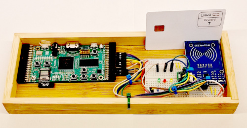
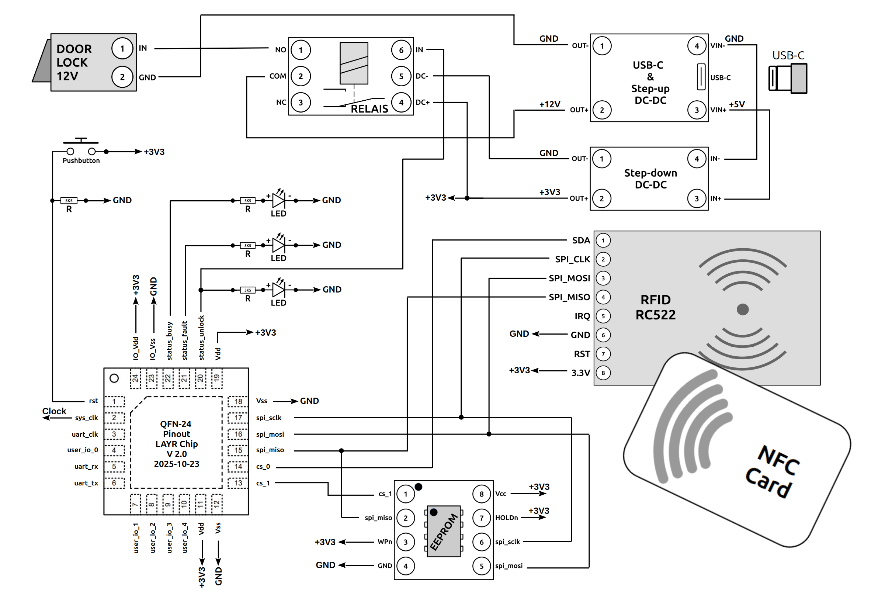
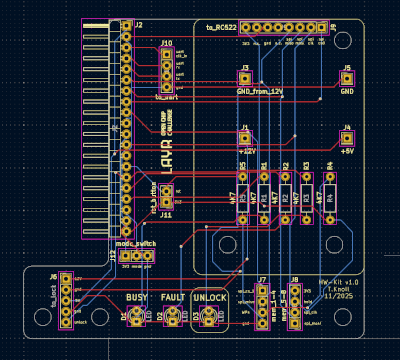
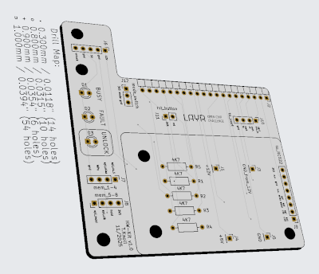
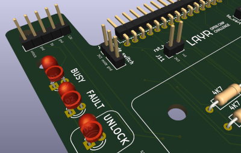
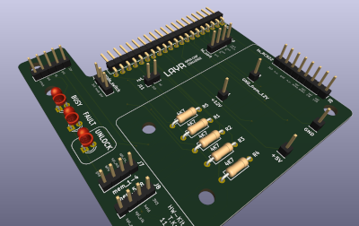

# The LAYR 25/26 demonstrator

## Description
The LAYR demonstrator is a hardware device. It brings the microchips to live and shows the functionality of the doorlock. Over the span of the LAYR 25/26 challenge the demonstrator goes through some development stages and various enhancements. 

The components of the LAYR hardware kit are used in the demonstrator to assemble a doorlock.

## Schematic V1.0

#### The schematics
[Link to Schematics as OpenOffice document](https://github.com/OCDCpro/LAYR/tree/main/demonstrator/schematic)

#### The symbols
[Link to all the single symbols from the hardware kit, as OpenOffice documents](https://github.com/OCDCpro/LAYR/tree/main/hardware_kit/pics/symbols)

## Pictures V1.0

## FPGA prototyping

#### Bitstream for ULX3S 85F FPGA board
There is a bitstream for the ULX3S 85F FPGA board available. This implementations solves all task of the LAYR 25/26 challenge. The HDL sources of the bitstream are not published yet, as they would give away a full solution for the LAYR challenge.

#### Bitstream
[Link to bitstream for ULX3S 85F FPGA](https://github.com/OCDCpro/LAYR/tree/main/demonstrator/bitstream_ulx3s)

#### Flashing the bitstream
The bitstream can be flashed to the ULX3S with the tool fujprog. For the usage, see the readme of fujprog here:

[Link to fujprog](https://github.com/kost/fujprog)

#### ULX3S pinout of the bitstream
t.b.a.

## PCB

#### Kicad files

[Kicad files v1.0](https://github.com/OCDCpro/LAYR/tree/main/demonstrator/kicad/demostrator_pcb_v1.0)

