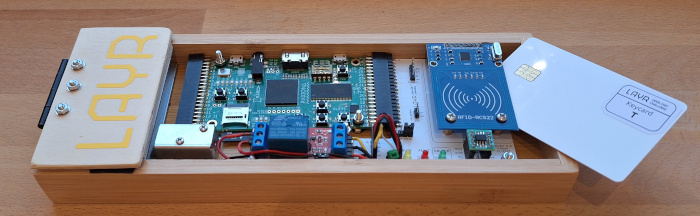

# The LAYR 25/26 demonstrator

## Description
The LAYR demonstrator is a hardware device. It brings the microchips to live and shows the functionality of the doorlock. Over the span of the LAYR 25/26 challenge the demonstrator goes through some development stages and various enhancements. 

The components of the LAYR hardware kit are used in the demonstrator to assemble a doorlock.

## FPGA prototyping

#### Bitstream for ULX3S

## PCB

#### Kicad files

## Schematic V1.0

## Pictures V1.0

