# The LAYR 25/26 hardware kit

##  Description
The LAYR hardware kit will be handed out to the teams. Each team gets one hardware kit.
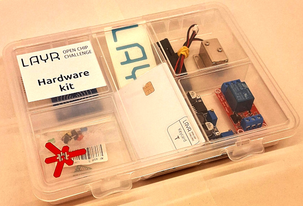

### Notes:
- The complete box is a gift.
- No return.
- Do want you want with it.

## Content in the kit

### Devices:
* 1 x NFC RC522 Reader, SPI
* 1 x Memorychip AT205010B on Pinheader board, SPI
* 1 x Keycard, Java, pre-programmed

### Power:
* 1 x DC-DC stepdown converter
* 1 x Relais 12V
* 1 x Powersupply board USB-C with step-up converter

### Actors and Sensors:
* 1 x Doorlock 12V
* 5 x LEDs and resistors
* 2 x Pushbuttons 

## Content pictures and descriptions

### NFC Reader with RC522 Chip and SPI
| Photo | Symbol |
| ----- | ------ |
| 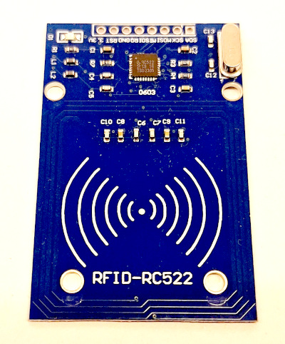 | 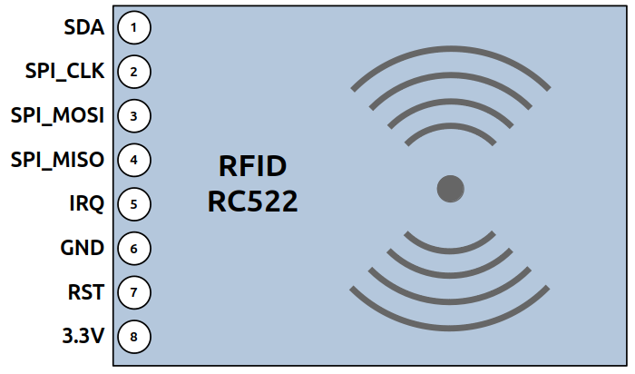   |

### EEPROM Memory AT25010B on Pinheader board, SPI
| Photo | Symbol |
| ----- | ------ |
| 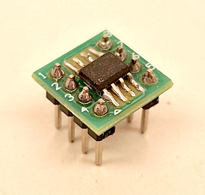 | 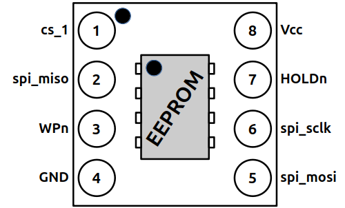 |

### Keycard (Javacard), pre-programmed
| Photo | Symbol |
| ----- | ------ |
| 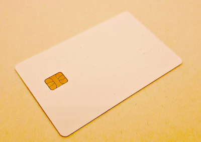 | 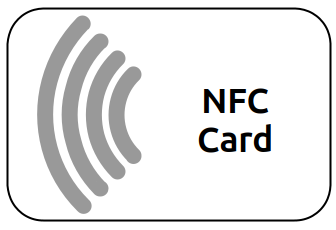

#### Pre-programmed data on the JavaCards
All keycards have been programmed with a unique AES-128 key and 128-bit ID. You can find the data that
corresponds to your card in the table below. All values are in hex.

| Card Label | AES Key                            | ID                                 |
| ---------- | ---------------------------------- | ---------------------------------- |
| A          | `39558d1f193656ab8b4b65e25ac48474` | `bbe8278a67f960605adafd6f63cf7ba7` |
| B          | `35d78ceccb60461ff7dbcb341caeea00` | `d0d23f18251c6087566de7b7deab7774` |
| C          | `25d872b92bcf115fd929bd9acf2fd49d` | `28d7c47f5bd16c9814a142aa4ba28823` |
| D          | `0614e9e59a36d7d9d43b80ed04b84001` | `aa46f7689a200a24327aefdcf3a03a40` |
| E          | `b63e7668c3f1a6212d7b19b9c0045f5e` | `7a8404068420c249c8ae65ea499bd9f7` |
| F          | `3eb969973d3cce4717763ebf115ff496` | `191617ccffbfbe1c2cc0f48bd1f04fa5` |
| G          | `2eb5df6306afab96cdd8cf88a158bf62` | `a91657d9d97f557bbdc062db6340cc90` |
| H          | `a157ef30050522bef1df789fafb94955` | `c88d1dd2085fb8b40efb83cf2f6c6c6f` |

### DC-DC Step-down Converter
| Photo | Symbol |
| ----- | ------ |
| 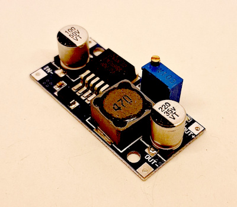 | 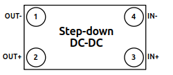 |

### Relais 12V
| Photo | Symbol |
| ----- | ------ |
| 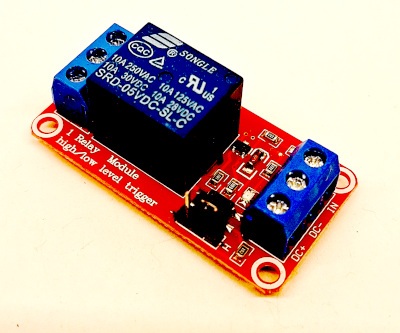 | 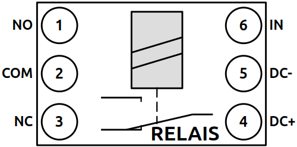 |

### USB-C Powersupply board with step-up converter
| Photo | Symbol |
| ----- | ------ |
| 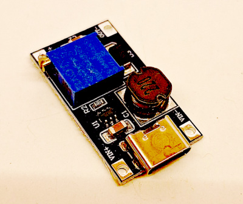 | 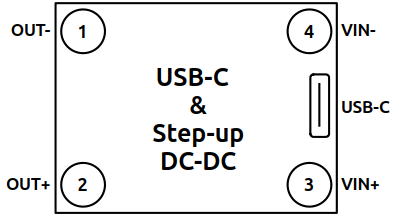

### Doorlock 12V
| Photo | Symbol |
| ----- | ------ |
|  | 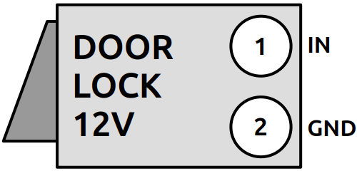

### LEDs, Buttons and Resistors
| Photo | Symbol |
| ----- | ------ |
| 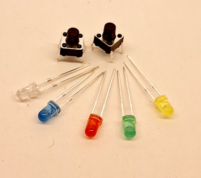 | 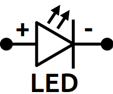 |
|   | 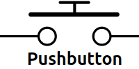 |
|   | 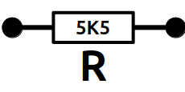 |

